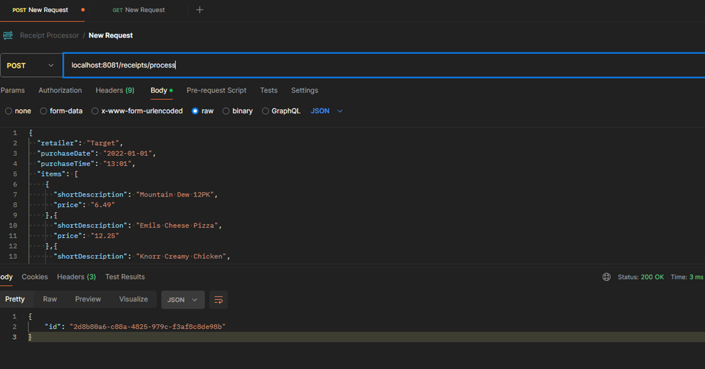
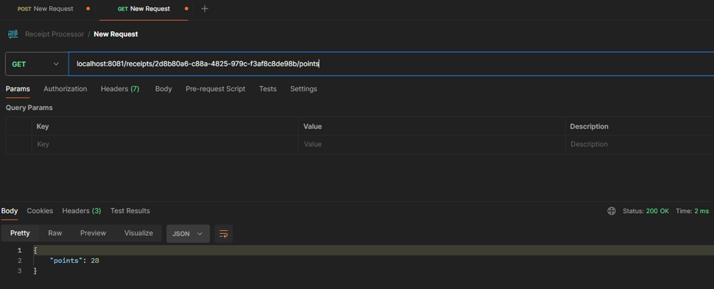

# Receipt Processor webservice 

The Receipt Processor is a web service that processes receipt data and calculates points based on specified rules. 
This project provides two main API endpoints: 
POST : for processing receipts and generating an ID
GET : for retrieving the points associated with a specific receipt ID.

## Prerequisites

* Go 
* Git

## Installation

* Clone the git repository
* Navigate to the project directory
    ```
    cd receipt-processor
    ```
* Install the dependencies using below command
    ```
    go mod tidy
    ```
* Run the application using following command
    ```
    go run main.go
    ```
    Also, you can use `CompileDaemon` for automatic recompilation during development

    ```
    CompileDaemon -command="./receipt-processor"
    ```
* To run the Tests, use following command:
    ```
    go test ./...
    ```

## URI Pattern of POST Request

`POST : http:localhost:8081/receipts/process`

## API Descriptions

POST API, that takes in a JSON receipt and returns an ID generated for the object. The ID returned is the ID that should be passed into GET endpoint to get the number of points the receipt was awarded.

## API Invocation Pattern

### HTTP Method : `POST`

## Request

Sample request to post receipt object and get the generated ID.

`POST : http:localhost:8081/receipts/process`

```json

{
  "retailer": "Target",
  "purchaseDate": "2022-01-01",
  "purchaseTime": "13:01",
  "items": [
    {
      "shortDescription": "Mountain Dew 12PK",
      "price": "6.49"
    },{
      "shortDescription": "Emils Cheese Pizza",
      "price": "12.25"
    },{
      "shortDescription": "Knorr Creamy Chicken",
      "price": "1.26"
    },{
      "shortDescription": "Doritos Nacho Cheese",
      "price": "3.35"
    },{
      "shortDescription": "   Klarbrunn 12-PK 12 FL OZ  ",
      "price": "12.00"
    }
  ],
  "total": "35.35"
}

```
## Response

```
{
    "id": "2d8b80a6-c88a-4825-979c-f3af8c8de98b"
}
```

### HTTP Code: 200 OK


## URI Pattern of GET Request

`GET : http:localhost:8081/receipts/:id/points`

## API Descriptions

GET API, that looks up the receipt by the ID and returns an object specifying the points awarded.

## API Invocation Pattern

### HTTP Method : `GET`

## Request

Sample request to post receipt object and get the generated ID.

`GET : http:localhost:8081/receipts/2d8b80a6-c88a-4825-979c-f3af8c8de98b/points`

## Response

```
{
    "points": 28
}
```

### HTTP Code: 200 OK


## Output Snapshots







